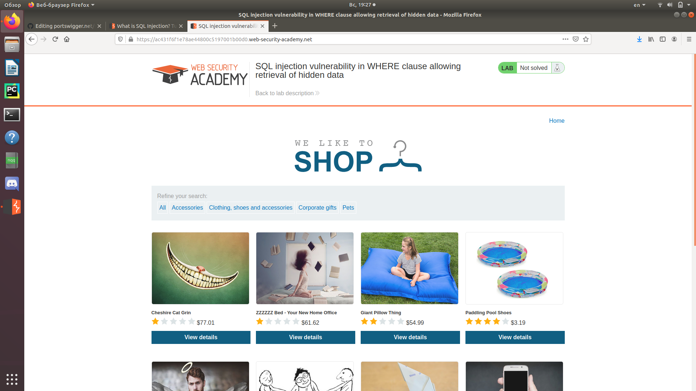
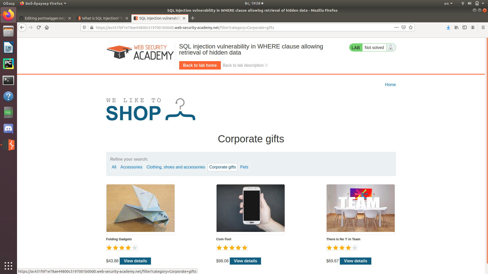
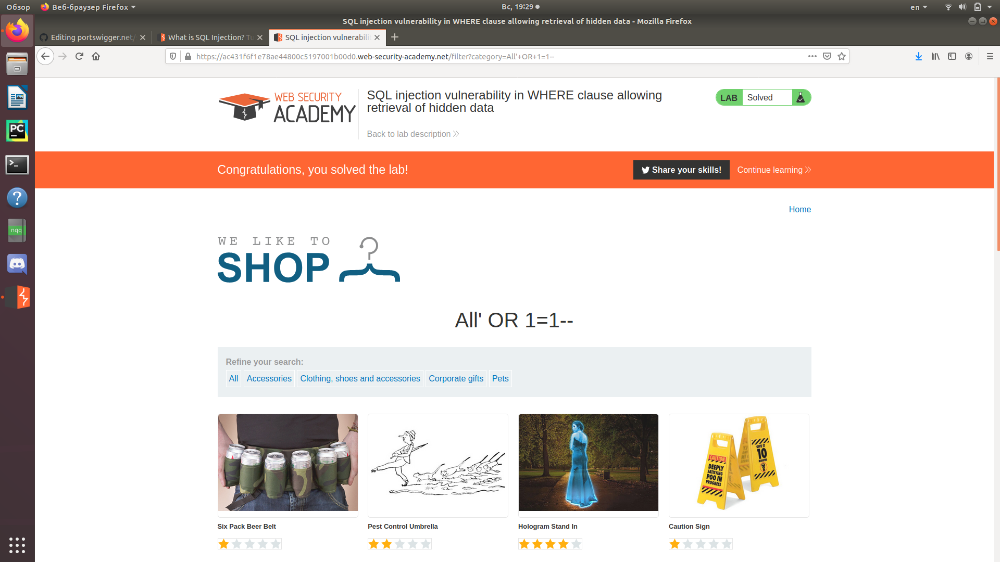

Заметим, что на главной странице сайта при выбранной категории "All" в URL нет атрибутов, значит, All используется по умолчанию.  
   
Далее при переходе к другим категориям мы видим "filter?category=..."   
   
Чтобы отключить фильтр, присвоим category=All, далее укажем всегда верное равенство, а остальное закомментируем.  
 
