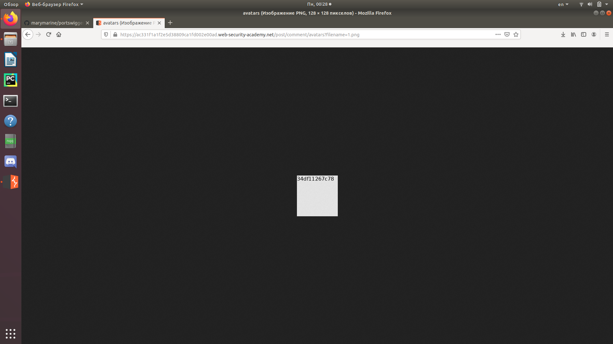

Заходим на сайт, выбираем статью и нажимаем "View post".  
   
Оставляем комментарий и перехватываем запрос с помощью Burp.  
   
Отправляем запрос в Repeater.  
   
Изменяем запрос, отправляем его и получаем ответ.  
  
Заходим на сайт, видим наш комментарий с изображением на аватарке.  
  
Посмотрим на это изображение.  
  
Введем код с изображения в форму ответа.  
  
  
