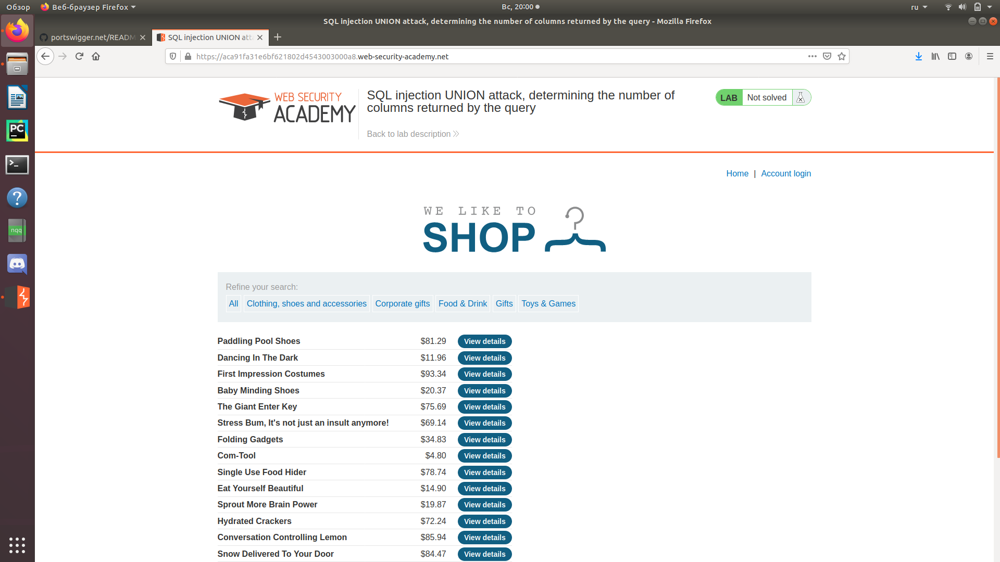
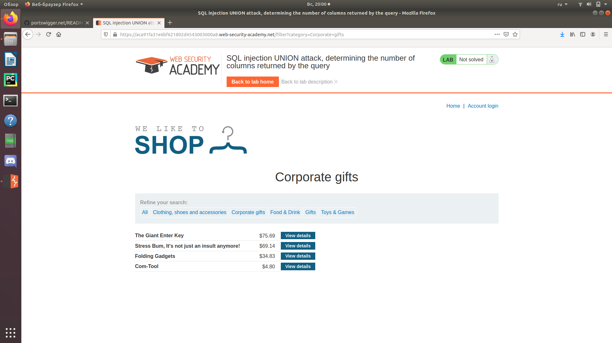
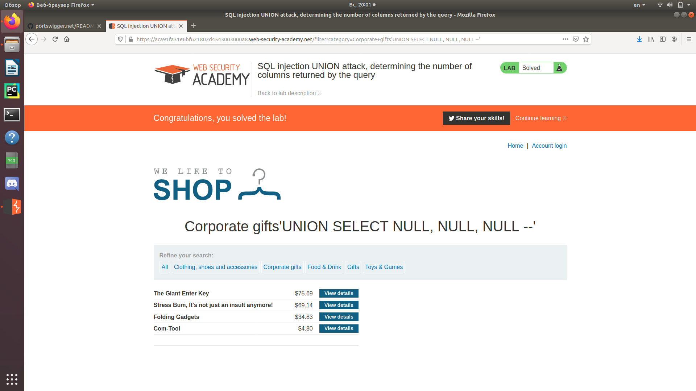

Зайдем на сайт.  
   
Выберем любую категорию (не по умолчанию).  
   
Путем перебора количества NULL в запросе типа 'UNION SELECT NULL, NULL, ... NULL--' получаем количество столбцов (равное количеству NULL).  
   
В данном случае их 3.
