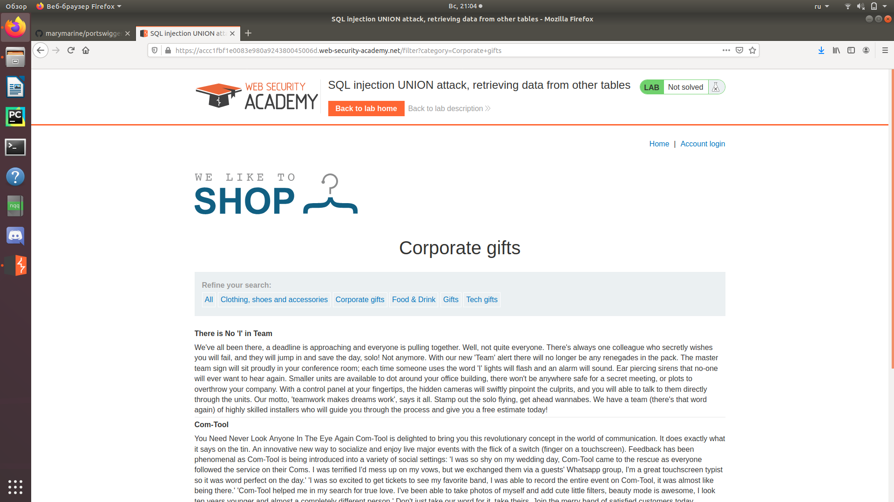
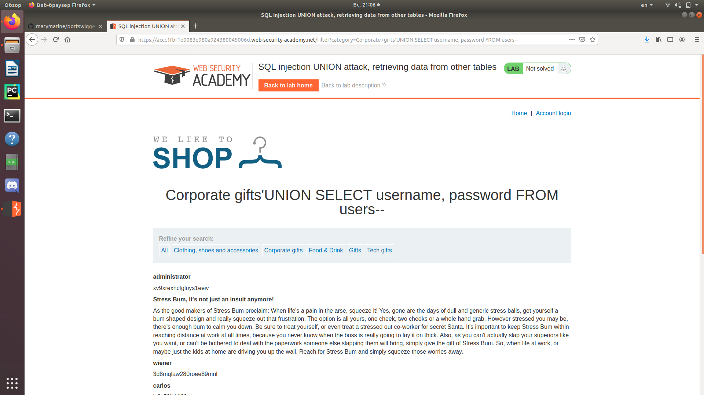
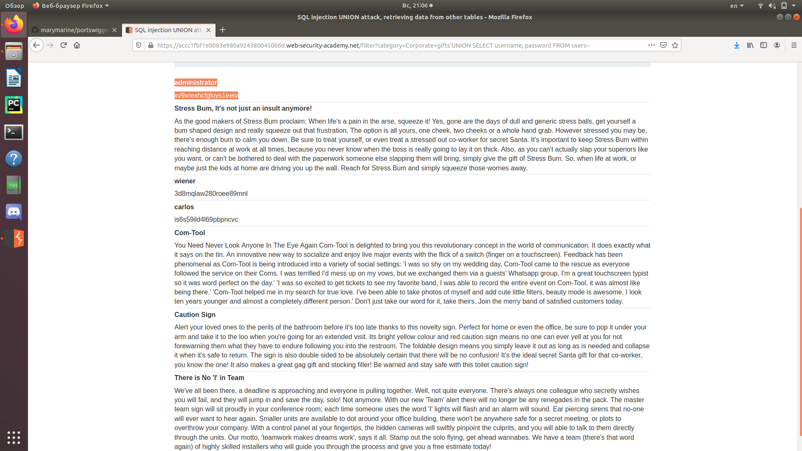
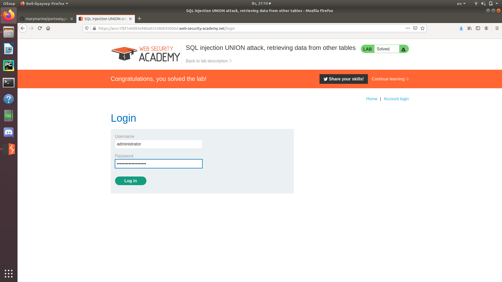
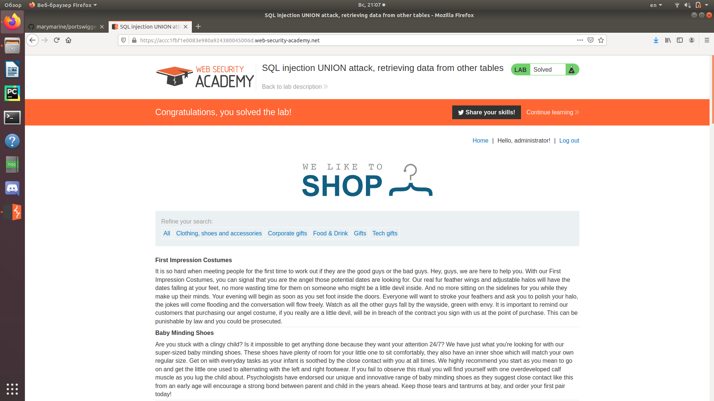

Зайдем в любую категорию.  
   
Введем запрос 'UNION SELECT username, password FROM users--  
   
Получим данные с логинами и паролями пользователей.  
   
Найдем данные для аккаунта администратора и введем их в форму входа на сайт.  
  
Мы смогли залогиниться от имени администратора.  
  
