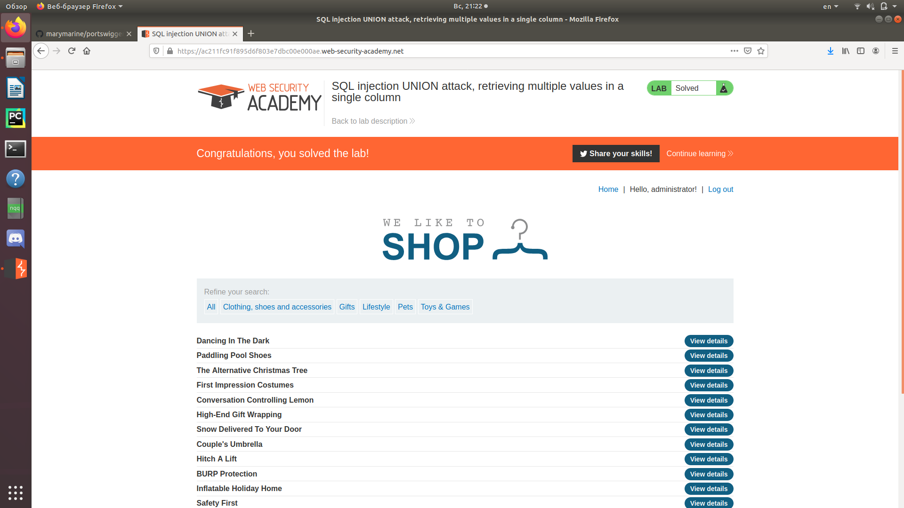

Зайдем в любую категорию и определим количество столбцов способом, описанным в Lab3. 
В данном случае у нас 2 столбца  
   
Проверим, какие из столбцов содержат текст.  
   
Подходит только 2 столбец.  
   
Введем запрос 'UNION SELECT NULL,username ||'~'|| password FROM users-- 
Получим данные вида логин~пароль.  
  
Возьмем данные администратора и залогинимся с помощью них.  
  
Мы смогли зайти от имени администратора.  
  
