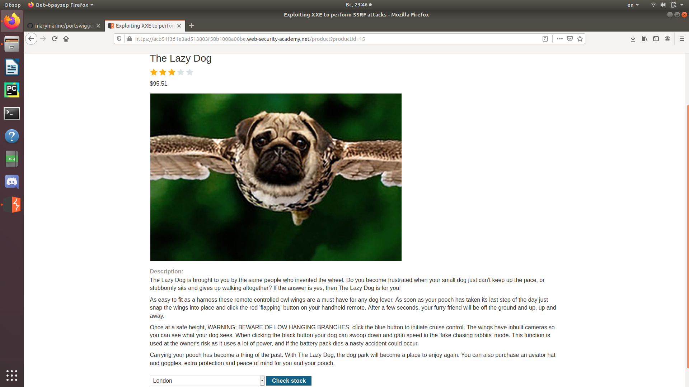
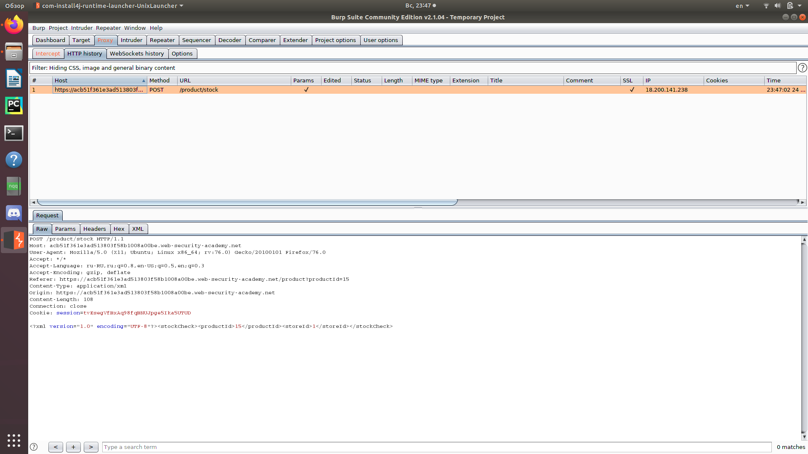
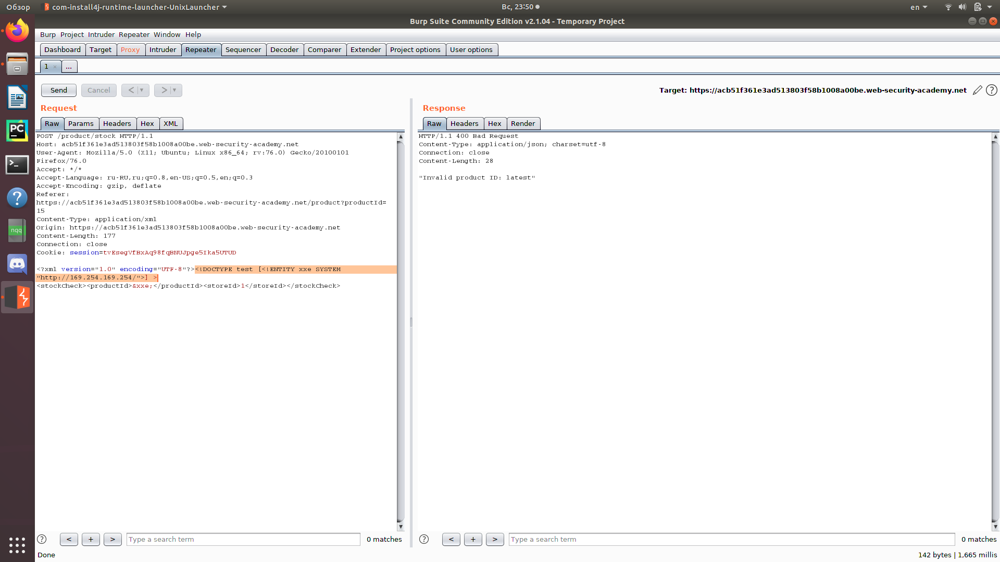
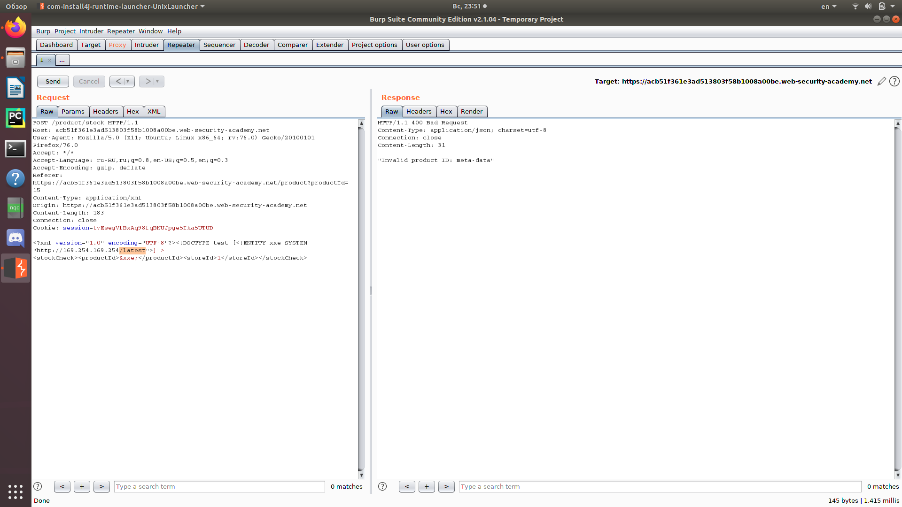
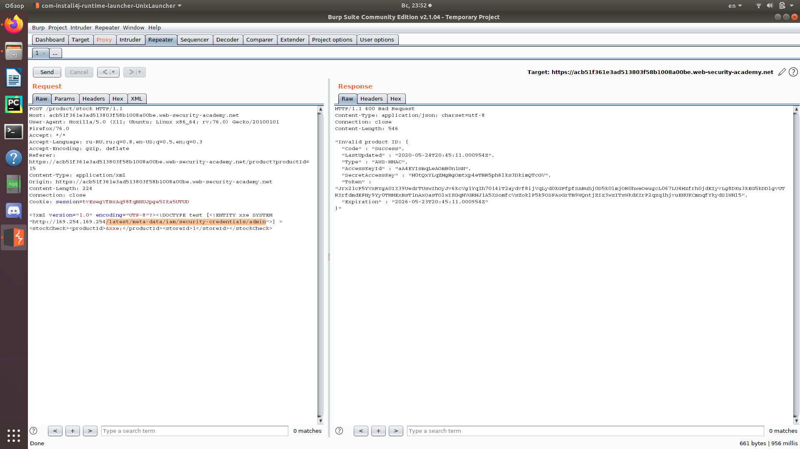
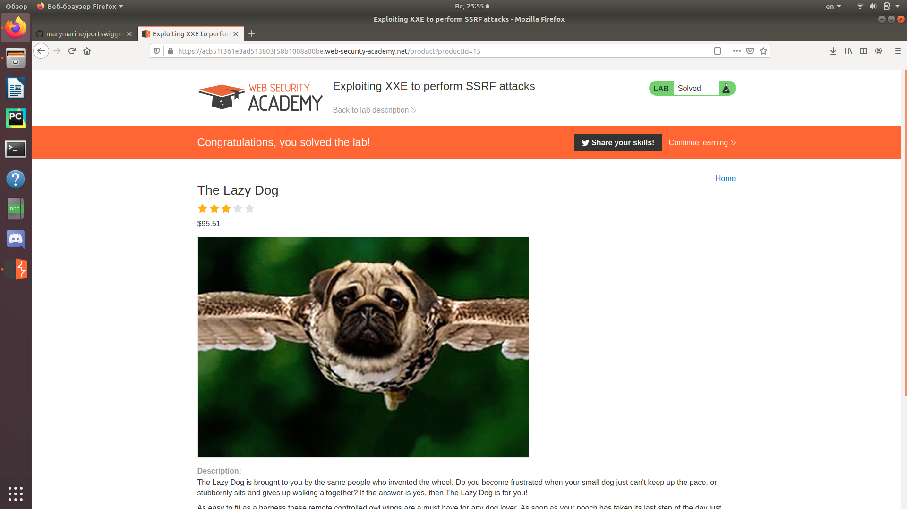

Заходим на сайт, выбираем любой товар и нажимаем "View details". 
Нажимаем "Check stock" и перехватываем запрос с помощью Burp Suite.  
   
Отправляем запрос в Repeater.  
   
Изменяем запрос, отправляем его и получаем ответ.  
  
По добавленному нами адресу находится директория latest. Добавим её в запрос.  
  
Сделав несколько аналогичных итераций, получим полный путь.  
  
  
